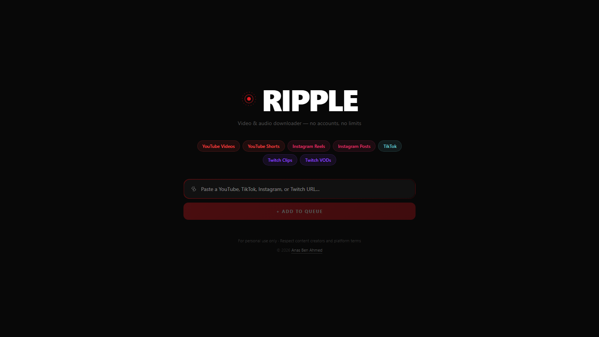

<!-- ============ HEADER BANNER ============ -->


<!-- ============ BADGES ============ -->
<p align="center">
  
  &nbsp;
  
  &nbsp;
  
  &nbsp;
  
</p>

<!-- ============ ANIMATED TAGLINE ============ -->
<p align="center">
  
</p>

<!-- ============ PLATFORM ROW ============ -->
<p align="center">
  
  
  
  
</p>

<!-- divider -->


<!-- ============ ABOUT ============ -->
<h2 align="center"> About</h2>

<p align="center">
  <b>Ripple</b> is a self-hosted video and audio downloader for <b>YouTube, Instagram, TikTok, and Twitch</b>.<br/>
  Paste a link, choose a quality, and download — no sign-in, no watermarks, no third-party services.
</p>

<p align="center">
  Built <b>from scratch</b>: a fast Python/FastAPI backend that talks directly to each platform's own<br/>
  endpoints, paired with a clean Next.js queue-based UI — lean, dependency-light, and muxing<br/>
  everything on the fly with <code>ffmpeg</code>.
</p>

<!-- divider -->


<!-- ============ PREVIEW ============ -->
<h2 align="center">🖼️ Preview</h2>

<p align="center">
  
</p>

<!-- divider -->


<!-- ============ FEATURES ============ -->
<h2 align="center">✨ Features</h2>

<p align="center">
🎬 &nbsp;<b>Multi-platform</b> — YouTube videos &amp; Shorts, Instagram Reels / Posts / Carousels, TikTok, Twitch Clips &amp; VODs<br/><br/>
🎚️ &nbsp;<b>Quality picker</b> — MP4 at 1080p / 720p / 480p / 360p, or grab audio as <b>M4A</b> (fast copy) or <b>MP3</b><br/><br/>
⚡ &nbsp;<b>Fast downloads</b> — bypasses YouTube's per-connection CDN throttling with chunked range requests<br/><br/>
📊 &nbsp;<b>Live progress</b> — real-time speed and percentage for every item in the queue<br/><br/>
🔓 &nbsp;<b>No login</b> — pulls public content straight from each platform's web API<br/><br/>
🧱 &nbsp;<b>From scratch</b> — direct platform extraction, no heavy download stack, just HTTP + <code>ffmpeg</code>
</p>

<!-- divider -->


<!-- ============ SUPPORTED ============ -->
<h2 align="center">🌐 Supported Platforms</h2>

<div align="center">
<table>
  <tr>
    <td width="50%" valign="top">
      <h3>▶️ YouTube</h3>
      <p><b>Videos &amp; Shorts</b><br/>
      🎬 MP4 — 1080p / 720p / 480p / 360p<br/>
      🎵 M4A (fast) &amp; MP3 — audio</p>
    </td>
    <td width="50%" valign="top">
      <h3>📸 Instagram</h3>
      <p><b>Reels, Posts &amp; Carousels</b><br/>
      🎬 MP4 — video<br/>
      🎵 M4A (fast) &amp; MP3 — audio<br/>
      🖼️ JPG — photos &amp; carousel slides</p>
    </td>
  </tr>
  <tr>
    <td width="50%" valign="top">
      <h3>🎵 TikTok</h3>
      <p><b>Videos &amp; Slideshows</b><br/>
      🎬 MP4 — watermark-free, source quality<br/>
      🎵 M4A (fast) &amp; MP3 — audio</p>
    </td>
    <td width="50%" valign="top">
      <h3>🟣 Twitch</h3>
      <p><b>Clips &amp; VODs</b><br/>
      🎬 MP4 — up to 1080p60, full quality ladder<br/>
      🎵 M4A (fast) &amp; MP3 — audio</p>
    </td>
  </tr>
</table>
</div>

<!-- divider -->


<!-- ============ TECH STACK ============ -->
<h2 align="center">🧰 Tech Stack</h2>

<p align="center">
  <b>Backend</b><br/>
  
</p>
<p align="center">
  <b>Frontend</b><br/>
  
</p>
<p align="center">
  <b>Media</b><br/>
  
</p>

<!-- divider -->


<!-- ============ GETTING STARTED ============ -->
<h2 align="center">🚀 Getting Started</h2>

<p align="center"><b>Prerequisites</b></p>

<p align="center">
  Python <b>3.11+</b> &nbsp;·&nbsp; Node.js <b>18+</b> &nbsp;·&nbsp; <a href="https://ffmpeg.org/download.html"><code>ffmpeg</code></a> on your <code>PATH</code>
</p>

**1 · Backend**

```bash
cd backend
pip install -r requirements.txt
uvicorn main:app --port 8006
# → http://localhost:8006
```

**2 · Frontend**

```bash
cd frontend
npm install
npm run dev
# → http://localhost:3000
```

<p align="center">
  Open <b>http://localhost:3000</b>, paste a link, and hit <b>Add to Queue</b>.
</p>

<!-- divider -->


<!-- ============ TESTS ============ -->
<h2 align="center">🧪 Tests</h2>

<p align="center">
  The backend's URL routing — how each link is matched to the right platform extractor —<br/>
  is covered by <b>pytest</b>. Pure logic, no network calls.
</p>

```bash
cd backend
pip install -r requirements-dev.txt
pytest
```

<p align="center">
  <b>26 tests</b> across the four extractors' <code>match()</code> rules and the router's dispatch.
</p>

<!-- divider -->


<!-- ============ HOW IT WORKS ============ -->
<h2 align="center">⚙️ How It Works</h2>

<p align="center">
  Each platform has its own <b>extractor</b> that resolves a public URL into direct media<br/>
  streams using that platform's own web endpoints:
</p>

- **YouTube** → InnerTube player API (ANDROID_VR client), then merges the best video + audio streams with `ffmpeg`. A local CDN proxy fetches the streams in 10 MB range chunks to dodge per-connection throttling.
- **Instagram** → web GraphQL persisted query with the public `X-IG-App-ID`, returning media for reels, posts, and carousels without any login.
- **TikTok / Twitch** → direct resolution of the public stream URLs.

<p align="center">
  The FastAPI backend streams the result straight to your browser while reporting live progress;<br/>
  <code>ffmpeg</code> handles muxing and MP3 extraction on the fly — nothing is written to disk on the server.
</p>

<!-- divider -->


<!-- ============ UPDATING IDS ============ -->
<h2 align="center">🔧 Updating Platform IDs</h2>

<p align="center">
  Every platform-specific "magic value" lives in one file: <a href="backend/config.py"><code>backend/config.py</code></a>.
</p>

> [!IMPORTANT]
> These IDs **may** change — not for sure, but a platform **can** rotate one at any time. If **one** platform suddenly stops working while the others are fine, an outdated ID in `config.py` is the most likely cause. Here's how to find the new value. You only edit the text **between the quotes** — keep the quotes, then restart the backend.

<details>
<summary><b>📸 Instagram</b> — <code>INSTAGRAM_DOC_ID</code> / <code>INSTAGRAM_APP_ID</code></summary>

<br/>

1. Open any **public reel** on instagram.com in Chrome (logged out is fine).
2. Press **F12** → **Network** tab → tick **Fetch/XHR** → refresh the page.
3. In the filter box type **`graphql`** and click the **`graphql/query`** request.
4. Under **Payload**, find **`doc_id`** → copy that number into `INSTAGRAM_DOC_ID`.
5. Under **Headers**, find **`X-IG-App-ID`** → copy that number into `INSTAGRAM_APP_ID`.

</details>

<details>
<summary><b>🟣 Twitch</b> — <code>TWITCH_CLIENT_ID</code> / GraphQL hashes</summary>

<br/>

1. Open any **Twitch VOD or clip** in Chrome → **F12** → **Network** → filter **`gql`**.
2. Click a **`gql`** request → **Headers** → copy **`Client-ID`** into `TWITCH_CLIENT_ID`.
3. The two `*_HASH` values are query fingerprints and rarely change. If clips/VODs break, search "twitch gql `VideoMetadata` persistedQuery sha256Hash" for the current value and paste it between the quotes.

</details>

<details>
<summary><b>▶️ YouTube</b> — <code>YOUTUBE_CLIENT_VERSION</code></summary>

<br/>

YouTube rarely breaks. If it does, the Android-VR client version may have moved on. Search for the latest **"YouTube ANDROID_VR clientVersion"**, then update `YOUTUBE_CLIENT_VERSION` **and** the version number inside `YOUTUBE_USER_AGENT` to match.

</details>

<details>
<summary><b>🎵 TikTok</b> — nothing to update</summary>

<br/>

TikTok needs no IDs — Ripple reads the data embedded in the public video page, so there's nothing in `config.py` to change for it.

</details>

<!-- divider -->


<!-- ============ DISCLAIMER ============ -->
<h2 align="center">⚖️ Disclaimer</h2>

<p align="center">
  Ripple is an independent, open-source project. It is <b>not affiliated with, endorsed by, sponsored by,<br/>
  or associated with</b> YouTube, Google LLC, Meta Platforms / Instagram, TikTok / ByteDance,<br/>
  or Twitch / Amazon. All product names, logos, trademarks, and brands are the property of their<br/>
  respective owners and are used for identification purposes only.
</p>

<p align="center">
  This software is provided for <b>personal, educational use</b> — to download content you own or have the<br/>
  right to access. Users are solely responsible for how they use it and for complying with each platform's<br/>
  Terms of Service and all applicable copyright laws. The author accepts no liability for misuse.
</p>

<p align="center">
  <sub>© 2026 Anas Ben Ahmed · Provided "as is", without warranty of any kind.</sub>
</p>

<!-- ============ FOOTER WAVE ============ -->

